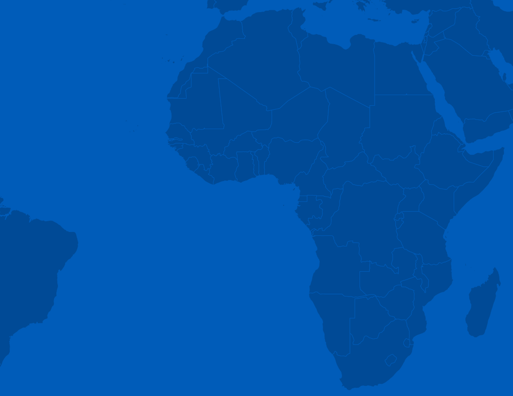
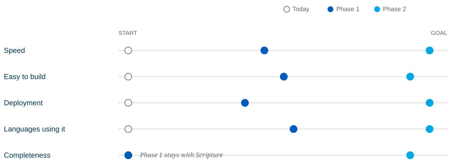
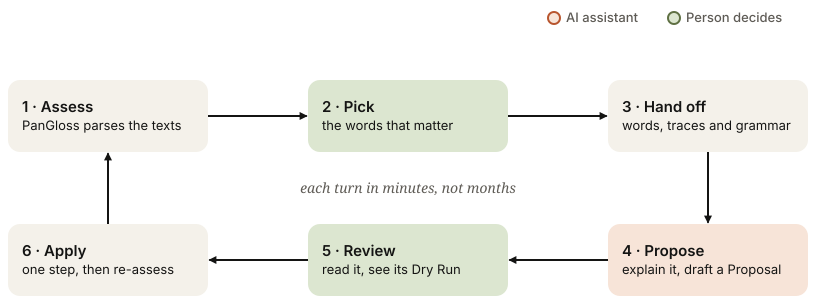
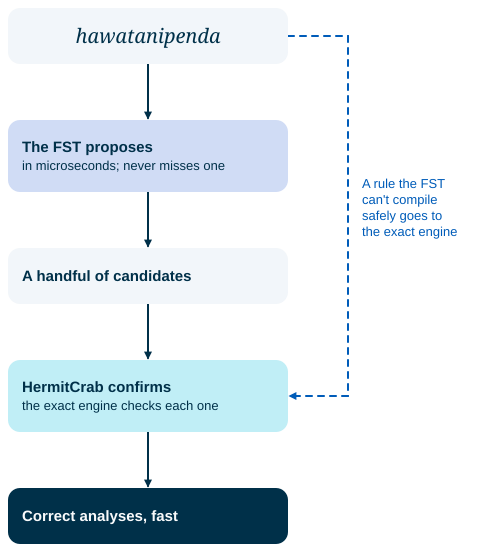
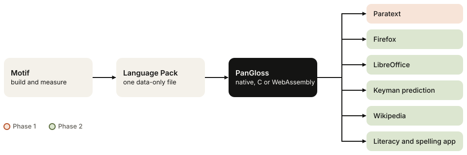
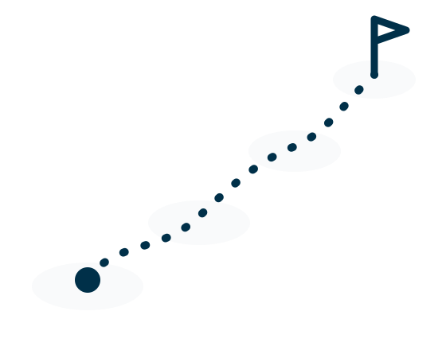

<!-- _class: cover -->
<!-- _paginate: false -->

# A Working Grammar for Every Language

How a parser that could analyse nearly every word in every language becomes one that does.


###### SIL · PanGloss and Motif · September 2026

---

<!-- _class: toc -->
<!-- _paginate: false -->

# Contents

1. Introduction *3*
2. The promise and the gap *5*
3. If all five flipped *9*
4. Phase 1: Bible translation *14*
5. Phase 2: Every language community *21*
6. Risks, costs and next steps *28*
7. Glossary and sources *32*

---

<!-- _class: cols -->

# Introduction

A **grammar**, in the sense this paper uses, is a description of how the words of a language are built: its roots, its prefixes and suffixes, the order they come in, and the sound changes that happen when they meet. A **parser** runs that description backwards. Give it a word, and it tells you what the word is made of and what each piece means.

SIL already owns a parser that can do this for nearly any language on earth. It is called **HermitCrab**, and it ships inside FieldWorks. The theory is proven. What has held it back is everything around the theory: it is slow, it is hard to build a grammar for, it runs in only two places, and so almost nobody uses it.

This paper argues that those limits are no longer technical, and sets out a two-phase plan to remove them.

**What you'll find here:**

- The five things that decide whether a parser matters
- **Phase 1**, built for Bible translation inside SIL, which pays for itself
- **Phase 2**, built for every language community, which needs partners

<div class="break"></div>

**Who this is for:** SIL leadership deciding whether to fund Phase 1; language technology and Bible translation leaders who would deploy it; and prospective partners for Phase 2.

**Two ways to read this**
In a hurry? Read the next page, then Chapter 3 (*Phase 1*) and Chapter 5 (*Risks, costs and next steps*). For the technical case, Chapter 3 describes the two products already in development, **PanGloss** and **Motif**, with measurements.

**What you'll get out of it:** By the end you should be able to answer three questions. Is the promise real? Is Phase 1 worth doing for Bible translation alone? And who else needs to be in the room for Phase 2?

> **The one idea** A grammar is software for a language. Once it is fast, easy to build and runs everywhere, every tool that handles text in that language gets better at once.

---

<!-- _class: axes -->
<!-- _header: 'In one page' -->

# The pitch in one page

| | Today | Phase 1 — Bible translation | Phase 2 — Every language community |
|---|---|---|---|
| **Speed** | Really slow: minutes to hours for a text | **50× faster**: PanGloss plus algorithm improvements | **1,000× faster**: grammars compiled to finite-state machines |
| **Easy to build** | No statistics; needs a computational linguist and years | Statistics, timing, progress and grammar-health diagnostics, with AI assistance | Full Motif: AI proposes grammar changes, statistical harvesting of the lexicon |
| **Deployment** | FieldWorks and FLExTrans only | Automatic back-translations and spelling checks in **Paratext** | Firefox, LibreOffice, Wikipedia, Keyman prediction, literacy apps |
| **Languages using it** | Under 10 | **Hundreds**: a clear win for every Bible translation project | A **marketplace** of parsers anyone can use |
| **Completeness** | Scripture only | Still Scripture only | Coverage checks and report cards for news, health, literacy and school |

> > **The ask** Fund Phase 1 as a Bible translation tool. It is justified on that use alone. Treat Phase 2 as the long-term prize, and start the partner conversations now, because it needs them.

---

<!-- _class: chapter c1 -->
<!-- header: Chapter 1 -->
<!-- _paginate: false -->



###### Chapter 1

# The promise and the gap

---

<!-- _class: cols -->

# The promise and the gap

## What a parser does

In much of the world a single word is a whole sentence. The Swahili word *hawatanipenda* means "they will not love me":

<div class="word"><span><b>ha</b><i>not</i></span><span><b>wa</b><i>they</i></span><span><b>ta</b><i>will</i></span><span><b>ni</b><i>me</i></span><span class="root"><b>pend</b><i>love</i></span><span><b>a</b><i>(ending)</i></span></div>

A verb can have thousands of forms; one study counts 2,253 possible forms of a single Finnish noun. A word list cannot hold them all, so spell checkers for these languages flag correct words and miss wrong ones. A parser knows the pieces and the rules, and works out any word from them.

## HermitCrab

HermitCrab is SIL's rule-based morphological parser. It models what linguists describe: roots and affixes, templates of slots, and sound changes at the boundaries. It ships in **FieldWorks Language Explorer (FLEx)** and is used by **FLExTrans** for machine translation. In principle it can parse nearly every word in every language. In practice it almost never gets the chance.

<div class="break"></div>

## Why a grammar is worth having

A working grammar is not an end in itself. It is an engine that other tools switch on:

- **Spell checking** that understands words it has never seen
- **Word prediction** on phone keyboards, which matters most where typing is hardest
- **Glossing and back-translation**, so a consultant can read a draft they don't speak
- **Search** that finds every form of a word, not just the one typed
- **AI**, which is weakest exactly where text is scarce, and gains most from structured knowledge of a language

> **The gap** Every one of these tools depends on the same thing, and for most of the world's languages that thing does not exist in usable form.

---

<!-- _class: cards -->

# Five things decide whether a parser matters

HermitCrab scores low on all five today.

- **1 · Speed** Really slow. On an Amharic grammar, a list of 7,000 words takes about half an hour, and one word in six is abandoned at a five-second limit. People stop re-parsing after each change, and a parser nobody re-runs never improves.
- **2 · Easy to build** No statistics and no progress measures. Building a grammar takes a computational linguist or computer scientist, and years.
- **3 · Deployment** Only in FieldWorks and FLExTrans. None of the places people actually type, read or publish can use it.
- **4 · Languages using it** By our count, fewer than ten languages use it seriously. Ethnologue counts 7,159 living languages.
- **5 · Completeness** Where grammars exist, they are built and tested against Scripture only, not the everyday language of news, health or school.

> **Why this matters** These five reinforce each other. Slow parsing makes grammars hard to build; hard grammars mean few languages; few languages mean no one integrates the parser anywhere; no deployment means no reason to make grammars complete. **Break one and the others start to move.**

---

<!-- _class: cols -->

# The limits are not in the theory

HermitCrab's model of language is sound. The problems are all in the engineering and the tooling around it, which is exactly the part that has become cheap.

### Slow because of how it searches

HermitCrab tries every way a word *could* have been built, running rules backwards, and checks each against the lexicon. Much of that work is repeated or doomed from the start. Better algorithms can skip it without changing a single answer.

### Hard to build because it is a black box

When a word fails to parse, the grammar author gets a pass or a fail and little else. There is no view of which rules are expensive, which never fire, or which let in nonsense. So building a grammar means years of trial and error by someone who can read the engine's traces.

<div class="break"></div>

### Stuck in FieldWorks because of its runtime

HermitCrab is a C# library that runs inside FieldWorks' process, reading FieldWorks' own data. A browser, a keyboard app or a word processor cannot load it.

### Few languages, and Scripture only, because of the other three

Nobody invests years in a grammar that only one desktop application can use. FieldWorks itself serves more than 1,300 language communities; almost none of them run its parser in earnest.

> **What changed** Two things. First, a faithful re-implementation in a language that runs anywhere is under way, and already beats the original on hard words. Second, AI coding agents have made building this kind of tooling dramatically cheaper, and AI assistants can now help a linguist read a trace and propose a fix. **There are no technical barriers left, only work.**

---

<!-- _class: chapter c2 -->
<!-- header: Chapter 2 -->
<!-- _paginate: false -->


###### Chapter 2

# If all five flipped

---

<!-- _class: cards -->

# If all five flipped

- **1 · Instant** Parsing is faster than typing. A whole Bible re-parses in the time it takes to save, and a keyboard can analyse each word as it is typed.
- **2 · Weeks, not years** Anyone with a good understanding of their language can build a grammar in a few weeks, with statistics, progress bars and an AI assistant that explains what went wrong.
- **3 · Everywhere** In Firefox and LibreOffice, on language-analysis websites, in spelling prediction and correction, and in instant back-translations for people and for AI.
- **4 · Every language** Not a showcase of ten, but every language community that wants one.
- **5 · Full content** Grammars that handle news, health information, literacy materials and primary school textbooks, not only Scripture.

> > **The picture** A grammar becomes a public good for its language, built once, maintained by its community, and used by every tool that handles text in that language.

---

<!-- _class: cols -->

# A day in that world

### A translator in Paratext

She finishes a draft of Mark 4. Before she saves, every word has been parsed. Three are flagged: two are typos, one is a new word the grammar has not seen. A literal back-translation appears beside her text, word by word, for the consultant who arrives next month and does not speak the language.

### A primary school teacher

A teacher prepares a reading book on the class laptop. LibreOffice underlines words that are misspelled, and not the correct ones that happen to be long. His pupils practise spelling on a phone app built from the same grammar.

<div class="break"></div>

### A Wikipedia editor

An editor writes a health article in her own language. The browser suggests corrections, and the keyboard predicts the next word from forms it has never seen, because it builds them from their parts.

### An AI system

A translation model working in a low-resource language asks the grammar what an unfamiliar word means, and gets its root and a gloss for each piece. The model's weakest languages now come with a precise, human-checked description.

> **None of this is science fiction** Each scenario uses tools that exist today: Paratext, LibreOffice, Firefox, Keyman, Wikipedia. What is missing is a fast, portable grammar for them to call.

---

<!-- _class: cols -->

# Why now

### The engine exists

**PanGloss** is a Rust port of HermitCrab, held to the original's answers by a conformance suite of 83 test projects. It reads FieldWorks projects directly and builds as a native program, a C library or WebAssembly for the browser.

### The workbench exists

**Motif** is a desktop application and command-line tool that shows a grammar author what their grammar is doing: which words parse, which fail, where the time goes, and what to fix. It packages the whole picture for an AI assistant in one click.

### The data exists

Translation work is in progress in 4,457 languages, and many of those teams keep lexicons and interlinear texts in FieldWorks. Much of what a grammar needs is sitting there, unused by any parser.

<div class="break"></div>

### Development cost has collapsed

PanGloss's first commit was on 10 July 2026. Less than three months later it has 26 Rust packages and about 2,900 tests. Motif, begun two weeks after it, has about 2,600 tests and 50 recorded design decisions. Both are built with AI coding agents under close human direction. The binding constraint is no longer engineering capacity; it is deciding what to build.

### AI makes grammar-building accessible

The hardest part of grammar work was reading the parser's output and working out why a word failed. An AI assistant given the trace, the grammar and example texts can explain it in plain language and propose a fix, which a person then reviews.

> **Phase 1 pays for itself** Bible translation already needs faster checking, back-translations and consistent spelling. Everything Phase 2 needs is built on the same foundation.

---

<!-- _class: cards2 dense -->

# Two phases

- **Phase 1 · Usable for Bible translation within SIL** Built with Bible translation only in mind, so its value is easy to judge and it can be deployed through SIL's own software. PanGloss and Motif make grammars fast and buildable; Paratext puts them to work. **Funded by the value it delivers to translation.**
- **Phase 2 · Usable for the flourishing of all language communities** Grammars leave the translation office: into browsers, word processors, keyboards, encyclopedias, literacy apps and a public marketplace. Coverage expands from Scripture to everyday language. **Needs external partners, if only for broader acceptance.**



> **How the phases connect** Phase 2 needs no new theory, only more reach. Every Phase 1 grammar is a Phase 2 grammar waiting to be published, and every Phase 1 tool is the foundation Phase 2 extends.

---

<!-- _class: chapter c3 -->
<!-- header: Chapter 3 -->
<!-- _paginate: false -->


###### Chapter 3

# Phase 1: Bible translation

---

<!-- _class: axes -->

# Phase 1 at a glance

Usable for Bible translation within SIL.

| | Today | Phase 1 | How |
|---|---|---|---|
| **Speed** | Really slow | **50× faster** | PanGloss, a Rust port of HermitCrab, plus algorithmic improvements that skip work without changing answers |
| **Easy to build** | No statistics; years of specialist work | **Stats, timing, progress and health diagnostics, with AI help** | PanGloss measures; Motif shows the measurements and hands the whole picture to an AI assistant |
| **Deployment** | FieldWorks and FLExTrans | **Paratext**: automatic back-translations and spelling detection | PanGloss runs as a single native program with no FieldWorks dependency |
| **Languages** | Under 10 | **Hundreds** | A clear win for any translation team that already has a FieldWorks lexicon |
| **Completeness** | Scripture only | Scripture only | By design: Phase 1 stays focused on the use that pays for it |

> **What Phase 1 does not try to do** Reach beyond Bible translation, publish grammars publicly, or compile finite-state machines. Those are Phase 2. Keeping Phase 1 narrow is what makes it cheap and quick to judge.

---

<!-- _class: cols dense -->
<!-- header: Chapter 3 · PanGloss -->

# PanGloss: the engine

**PanGloss** is HermitCrab, rebuilt in Rust. *Words in, morphemes out.*

### Faithful where it matters

PanGloss is held to HermitCrab's behaviour, not its source code: a conformance suite of 83 test projects checks that it gives the same analyses. Where the two differ, the difference is written up and tracked, not hidden. It opens a FieldWorks project directly, with no export step, and works from the same FLEx grammar that both FieldWorks parsers, HermitCrab and **XAMPLE**, read. A differential test compares its answers with XAMPLE's too.

### Faster by skipping work, not by guessing

The rule is strict: **an optimisation may cost memory or compile time, never a correct answer.** Each one is measured on real grammars and shipped only with identical results.

- **Pruning** abandons analysis paths that could never be rebuilt into the word. On a Mbugwe test grammar it cut the search by **98.6%** and ran **20× faster**.
- **Smarter bookkeeping** stops the parser comparing every candidate with every other. One hard Amharic word fell from 145 seconds to 54, now faster than the original's 64.
- **Parallel batches** spread a word list across every core.

<div class="break"></div>

### Deployable anywhere

Rust builds a single native program for Windows, macOS and Linux, with no runtime to install. The engine is built to be used as:

| Surface | For |
|---|---|
| `pangloss` command line | Scripts, CI, AI agents, Motif |
| C library interface | Paratext, FieldWorks, other native hosts |
| WebAssembly | Browsers and web pages |
| Language Pack (`.pgpack`) | One data-only file holding a compiled grammar: no code, so it is safe to share |

All four exist in source today. Packaged, signed releases are Phase 1 work.

### No finite-state compiler in Phase 1

A finite-state compiler makes parsing near-instant, and research on one is well advanced. Phase 1 does not depend on it. It is the centrepiece of Phase 2.

> **Why a port, not a new parser** Every existing FLEx grammar keeps working, and every answer can be checked against the original. Nobody has to trust a new engine on faith.

---

<!-- _class: cols dense -->
<!-- header: Chapter 3 · PanGloss -->

# Stats, health and timing

A grammar author cannot fix what they cannot see. PanGloss measures three things HermitCrab never reported.

### Timing

Every word is timed. The slowest words are listed, and a runaway word is stopped at a fixed step limit and reported, instead of hanging the batch.

### Statistics

Run over a representative word list, the statistics answer the questions an author actually asks:

```text
pangloss stats grammar.fwdata --group group
    where did the time go, by kind of rule?
pangloss stats grammar.fwdata --group never-fires
    which rules never produced anything?
pangloss stats grammar.fwdata --sort no-root
    which rules build forms no root can finish?
```

<div class="break"></div>

### Grammar health

`grammar-health` reads the grammar itself and lists problems to fix in FieldWorks, graded as errors, warnings or information. Two examples of what it catches:

- **A partial morpheme.** A stem with no category, or an affix with no slot, can attach almost anywhere. The parser then explores far more paths, and **one such entry can slow down every word**, not just the words that use it.
- **Two phonemes that look identical** once Unicode is normalised, so one is silently skipped or the two are confused.

> **The principle** Reporting never changes a parse. PanGloss keeps or drops exactly what HermitCrab would; the report only decides how loudly to say so.

> > **Why it matters** Statistics turn grammar-building from folklore into engineering. An author can make one change, re-run, and see whether it helped, in seconds rather than overnight.

---

<!-- _class: cols dense -->
<!-- header: Chapter 3 · Motif -->

# Motif: the workbench

**Motif** is where a grammar author works: a desktop application and a command-line tool with the same abilities, over the FieldWorks project the translation team already uses.

### What the window shows today

- **Overview**: how much of the chosen texts the grammar parses, how accurately, and how fast
- **Texts**: every word in context, parsed or not
- **Try a Word**: the parser's reasoning for one word, step by step, including where it gave up
- **Timing**: the slowest words and the rules that cost the most
- **Warnings**: the grammar-health report, ready to act on
- **Review changes** and **AI Handoff**

Motif runs PanGloss as a separate process, so a slow word never freezes the window.

<div class="break"></div>

### The AI Handoff

One click writes five small files: the grammar, the texts, the latest Assessment with traces for the words in question, a helper script, and a short guide. The author drags them into any AI chat and pastes a one-paragraph header. The assistant explains, in plain language, why a word failed and what to change. The full project never leaves the machine.

### Changes as Proposals

A change comes back as a **Proposal**: named operations such as *set this gloss* or *create this affix rule*, not a patch to a file. Motif runs a **Dry Run** on a copy of the project, then applies it in one step when a person approves. The first Proposal path works from the command line today; reviewing Proposals in the window, and covering the whole grammar, is Phase 1 work.

> **Built for review** A Proposal is reviewed before it lands, not cleaned up after. That is what makes it safe to let an AI suggest changes to a grammar a translation team depends on.

---

<!-- _class: dense -->
<!-- header: Chapter 3 · The loop -->

# The grammar-improvement loop

This is how a grammar gets better each week instead of each year. PanGloss measures, Motif shows, an AI assistant drafts, and a person decides. Steps 1 to 3 work in Motif today; Phase 1 finishes the return path from the assistant's advice to a reviewed Proposal.



<div class="trio">

**What the author needs** A good understanding of their language, and the judgement to say whether a proposed change is right. *Not* years of training in computational linguistics.

**What makes it fast** Assessments that finish in seconds; diagnostics that point at the problem; an assistant that reads traces so the author does not have to; changes that are safe to try.

**What keeps it honest** The grammar is tuned, never the parser. Every change has an author, a reason and a record, and is dry-run before it lands.

</div>

---

<!-- _class: cards2 dense -->
<!-- header: Chapter 3 · Deployment -->

# Putting grammars to work in Paratext

Paratext is where Bible translation happens: more than 15,000 users in nearly 550 organisations. It already has a word list, a spelling-status workflow, a prefix-and-suffix morphology check and a word-for-word interlinearizer. Phase 1 puts a real grammar behind them, as two features translators feel on the first day.

- **Automatic back-translations** Each verse gets a literal, word-by-word gloss built from the grammar's analysis: root meaning plus what each affix contributes. Consultants read a draft in a language they don't speak; teams spot where a word does not say what they meant. Later work turns morpheme glosses into natural phrases.
- **Spelling detection** A word the grammar cannot build is flagged. Unlike a word list, the grammar accepts the thousands of correct forms no list contains, and catches the misspellings a list would miss. Inconsistent spellings of the same word across a book are grouped for the team to resolve.

### Why hundreds of languages, not ten

Any translation team with a FieldWorks lexicon and some interlinear text already has most of a grammar's raw material. With Motif's diagnostics and an AI assistant, turning that into a working grammar becomes a project of weeks. The reward — back-translations and spelling checks — is something every team wants. **For Bible translation, this is a clear win.**

### Why it pays for itself

Consultant checking, back-translation and spelling consistency already cost translation projects real time and money. Phase 1 reduces all three, using software SIL already controls, on content SIL already works with.

---

<!-- _class: chapter c4 -->
<!-- header: Chapter 4 -->
<!-- _paginate: false -->


###### Chapter 4

# Phase 2: Every language community

---

<!-- _class: axes -->

# Phase 2 at a glance

Usable for the flourishing of all language communities.

| | Phase 1 | Phase 2 | How |
|---|---|---|---|
| **Speed** | 50× faster | **1,000× faster** | PanGloss 2.0 compiles a grammar into a finite-state machine that proposes answers in microseconds; the exact engine confirms them |
| **Easy to build** | Diagnostics and AI help | **AI generates changes; the lexicon is harvested statistically** | Motif 2.0 learns from parallel texts across many domains and integrates statistical tools |
| **Deployment** | Paratext | **Wikipedia, Firefox, LibreOffice, Keyman prediction, literacy apps** | Language Packs that any host can load, published through a marketplace |
| **Languages** | Hundreds | **Every community that wants one** | A marketplace where people post parsers for spell checkers, predictors and more |
| **Completeness** | Scripture only | **News, health, literacy, primary education** | Coverage checks and report cards that show where a grammar is thin |

---

<!-- _class: cols dense -->
<!-- header: Chapter 4 · PanGloss 2.0 -->

# PanGloss 2.0: instant

### Compiling grammars to finite-state machines

A **finite-state transducer (FST)** reads a word one letter at a time and emits its analysis. It is how the fastest morphological analysers in the world work: microseconds per word, small enough for a phone.

The risk with an FST is that it can be subtly wrong, because some grammar rules are hard to express in one. PanGloss 2.0 avoids that risk with **propose-and-confirm**: the FST *proposes* candidate analyses almost instantly, and the exact HermitCrab engine *confirms* each one.

The FST is held to never miss an analysis the full engine would find, so **it can only ever cost speed, never correctness.** Where a rule cannot be compiled safely, PanGloss says so and uses the exact engine for it.

> **Early measurements** In one August 2026 experiment over a 7,000-word list, this path ran **12× to 19× faster** than the full engine, with no timeouts and matching answers on the words compared. It is not yet certified: today's safety checks still refuse some grammar constructs, so they take the exact engine.

<div class="break"></div>



---

<!-- _class: cols dense -->
<!-- header: Chapter 4 · PanGloss 2.0 -->

# PanGloss 2.0: spelling and prediction

### From detection to correction

Detection says a word is wrong. Correction says what was meant. The plan layers four signals, each cheap enough to run as someone types:

1. **Edit candidates**: a precompiled index maps likely typos straight to real words in one pass
2. **Keyboard distance**: nearby keys on the actual layout make a slip more likely
3. **Sound-alikes**: spelling-by-ear errors, matched through the language's own sound rules
4. **Context**: word pairs and triples from real text rank the candidates

### Built from lots of text

PanGloss 2.0 builds caches of known words, their analyses and N-gram statistics from large text collections, so correction and prediction reflect how the language is really written.

<div class="break"></div>

### Prediction

A keyboard that predicts words needs to know which words exist. Keyman's predictive text today is built from word lists with frequencies. A grammar can generate those lists, including the valid forms a collected list would miss, and a later integration can ask the grammar directly.

### Hosted

The same engine in WebAssembly powers language-analysis websites: paste text, see every word analysed, no installation.

> **Why this matters for small languages** Where little text has been published, there is not enough data to learn spelling statistically. A grammar supplies what the data cannot.

---

<!-- _class: cols dense -->
<!-- header: Chapter 4 · Motif 2.0 -->

# Motif 2.0 and the marketplace

### AI that proposes the grammar

In Phase 1, the AI explains and drafts one change at a time. In Motif 2.0 it works from **parallel text**: translations of the same content in the language and in a language of wider communication, across many domains. From them it proposes new lexical entries and rules as Proposals, which people review exactly as before.

### Statistical harvesting of the lexicon

Words the grammar cannot yet parse are the work queue. Statistical tools cluster them, suggest likely roots and affixes, and rank them by how often they occur, so authors spend their time where it matters most.

### Post to the marketplace

When a grammar is good enough, Motif publishes it as a Language Pack, with its report card attached.

<div class="break"></div>

### The marketplace

A public home for parsers, owned by SIL (or a hypothetical partner such as the Wikimedia Foundation), where language communities post grammars and any tool can use them:

- **Spell checkers** in Firefox, LibreOffice and other editors
- **Predictors** in Keyman keyboards and on phones
- **Glossers** for websites, publishers and AI systems

A Language Pack contains data only, never executable code, so a host can load one from a stranger without running a stranger's program.

> **Ownership** A language's grammar belongs to its community. The marketplace makes sharing easy; it must also make it the community's choice. Licensing and consent are part of the design, not an afterthought.

---

<!-- _class: cards dense -->
<!-- header: Chapter 4 · Deployment -->

# Where the grammars land

- **Firefox and LibreOffice** Spell checking that understands how words are built, through the same engine in WebAssembly and as a native library.
- **Keyman prediction** SIL's keyboard platform, which supports typing in more than 2,500 languages, suggesting whole words built from their parts.
- **Wikipedia** Editing help across 364 language editions; in a small language, each article is a real share of everything written in it.
- **Literacy and spelling app** Helps learners practise the standard spelling of their language, and helps publishers apply it consistently.
- **Language-analysis websites** Paste a text and see every word analysed, for teachers, researchers and curious speakers.
- **AI back-translation** Instant, structured back-translations for people and for AI systems working in languages they barely know.



---

<!-- _class: cols dense -->
<!-- header: Chapter 4 · Completeness -->

# Report cards for completeness

A grammar built on Scripture knows Scripture's words. A health leaflet or a maths textbook will use many it has never seen. Phase 2 measures this directly, so a community knows what its grammar is ready for.

### Coverage checks

- **Text coverage** (in Motif today): what share of the words in the chosen texts the grammar parses
- **Grammar coverage**: the same measure over a named collection of texts, so a health leaflet and a gospel can be scored apart
- **Feature coverage** (designed): which combinations of affixes and slots the texts actually use, and which the grammar allows that no text shows. Each leftover is either a rule that is too broad or a word nobody has collected yet, and a person decides which

<div class="break"></div>

### A report card

An illustrative example, not measured data:

| Domain | Words parsed | Ready for |
|---|---|---|
| Scripture | 97% | Spell checking, back-translation |
| Health | 81% | Detection with review |
| Primary school | 74% | Not yet |
| News | 68% | Not yet |

Report cards travel with the Language Pack, so a host can decide whether a grammar is good enough for its use, and a community can see where to work next.

> **Broader adoption** Report cards turn "is this grammar any good?" into a question with a published answer, which is what partners outside SIL will need before they ship it.

---

<!-- _class: chapter c5 -->
<!-- header: Chapter 5 -->
<!-- _paginate: false -->



###### Chapter 5

# Risks, costs and next steps

---

<!-- _class: cards dense -->

# What could go wrong

- **Grammar-building is still skilled work** AI and diagnostics lower the bar; they do not remove it. **Mitigation:** Phase 1 targets teams that already have FieldWorks data and linguistic support, and measures how long a grammar really takes.
- **Speed targets are targets** 50× and 1,000× are goals, not measurements across real grammars. **Mitigation:** publish a benchmark on real translation grammars at each milestone; the conformance suite guarantees correctness is never traded for speed.
- **Some rules resist compilation** A few HermitCrab constructs cannot be compiled into a finite-state machine safely. **Mitigation:** propose-and-confirm falls back to the exact engine for those, so they cost speed, never answers.
- **Adoption outside SIL** Browser makers and encyclopedias will not ship tools they cannot evaluate. **Mitigation:** report cards, data-only Language Packs, open formats, and early partner conversations.
- **Prior art** Giellatekno and Divvun have built finite-state language tools for minority languages since 2001, now across more than 100 languages. **Mitigation:** PanGloss is complementary: it starts from grammars FLEx users already have, and confirms every FST answer against the exact engine. We borrow their best techniques.
- **Community ownership** Publishing a grammar is publishing a community's knowledge. **Mitigation:** consent and licensing built into the marketplace from the start.

---

<!-- _class: cols -->

# What it costs, and who pays

### Phase 1: SIL, justified by translation

Phase 1 builds on work already under way. PanGloss and Motif exist and run today; what remains is finishing them, integrating with Paratext, and supporting the first translation teams as they build grammars.

Because development is done with AI coding agents under close direction, the engineering cost is a small team, not a department. The larger cost is linguistic: supporting teams as they build their first grammars.

**Its return** is measured in consultant time, faster checking and better spelling in translation projects, which SIL already pays for today.

<div class="break"></div>

### Phase 2: SIL with partners

Phase 2 reaches beyond SIL's own software, so it needs others:

- **Wikimedia Foundation** for Wikipedia, and possibly as a neutral home for the marketplace
- **Mozilla** and **The Document Foundation** for Firefox and LibreOffice
- **Literacy and education organisations** for the spelling app and school content
- **Funders of language technology and development**, since the benefits are in literacy, health and education, not only in translation

> **If only for acceptance** Even where SIL could build a piece alone, a partner's name is what makes a browser, a ministry of education or a publisher trust it.

---

<!-- _class: cols -->

# Next steps

### For Phase 1

1. **Choose pilot projects.** Five to ten Bible translation teams with a FieldWorks lexicon, interlinear texts and a willing consultant.
2. **Publish a baseline.** Measure today's parse speed and coverage on their data, so every later claim has a before.
3. **Finish the loop.** Complete Motif's Assessment, Handoff and Proposal flow end to end on real projects.
4. **Ship in Paratext.** Back-translations and spelling detection, first to the pilot teams.
5. **Report.** Time to a working grammar, speedup achieved, and what translators and consultants say.

<div class="break"></div>

### For Phase 2

1. **Open the conversations now.** Wikimedia, Mozilla, The Document Foundation, Keyman, and one literacy partner.
2. **Agree the marketplace's owner** and its licensing and consent model.
3. **Prove one grammar end to end**: from FieldWorks to a spell checker in LibreOffice and a Keyman predictor, with a report card.

> > **The decision in front of us** Phase 1 is a Bible translation tool that pays for itself. Say yes to it, and the foundation for a working grammar for every language gets built along the way.

---

<!-- _class: cols dense -->
<!-- header: Appendix -->

# Glossary

**Affix** A piece added to a root: a prefix, suffix, infix or circumfix.

**Assessment** A PanGloss run over a set of words: every word parsed and timed.

**Dry Run** Trying a Proposal against a copy of the project to see its effect before it is applied.

**FieldWorks (FLEx)** SIL's desktop software for lexicons, texts and grammars.

**FLExTrans** A machine-translation system built on FieldWorks data.

**Finite-state transducer (FST)** A compact machine that reads a word letter by letter and emits its analysis, in microseconds.

**Grammar** A description of how the words of a language are built.

**Handoff** Motif's package of grammar, words, texts and traces for an AI assistant.

**HermitCrab** SIL's rule-based morphological parser.

<div class="break"></div>

**Keyman** SIL's keyboard platform, with predictive text.

**Language Pack** One data-only file holding a compiled grammar, loadable by any PanGloss host.

**Morpheme** The smallest piece of a word that carries meaning.

**Motif** The workbench for building, measuring and changing grammars, with an AI handoff.

**PanGloss** The Rust port of HermitCrab: fast, portable, measurable.

**Paratext** SIL and the United Bible Societies' software for Bible translation.

**Parser** Software that works out what a word is made of.

**Proposal** A reviewed set of named changes to a project, applied as one unit.

**XAMPLE** FieldWorks' older morphological parser.

---

<!-- _class: cols dense -->
<!-- header: Appendix -->

# Sources and further reading

### The projects

- PanGloss: README, the grammar diagnostics guide, the stats optimisation guide, and the spell-checking plan
- Motif: README, the Motif plan, and the Handoff format documents
- HermitCrab: part of [SIL.Machine](https://github.com/sillsdev/machine)

### Measurements quoted

- Half an hour for 7,000 Amharic words, one in six abandoned at five seconds; and 12× to 19× faster on the finite-state path: a Motif cross-repository measurement, August 2026
- 98.6% fewer steps and 20× faster: PanGloss's final-template prune on a Mbugwe test grammar, identical results, September 2026
- 145 to 54 seconds for one Amharic word, against 64 for the C# original: PanGloss profile findings, July 2026
- Repository ages, commits and test counts: git history as of 29 September 2026

### Background figures

- 7,159 living languages: [Ethnologue, 28th edition](https://www.ethnologue.com/) (2025)
- 4,457 languages with translation in progress: [Wycliffe Global Alliance](https://wycliffe.net/global-scripture-access/) (August 2025)
- 15,000+ Paratext users, ~550 organisations: [paratext.org](https://paratext.org/about/who-uses-paratext/)
- 2,500+ languages in Keyman: [keyman.com](https://keyman.com/)
- 364 Wikipedia editions: [Wikimedia Meta](https://meta.wikimedia.org/wiki/Wikipedia) (September 2026)
- 2,253 forms of a Finnish noun: [COLING 2018 paper](https://aclanthology.org/C18-1137.pdf)

<div class="break"></div>

### Background

- [FieldWorks](https://software.sil.org/fieldworks/) · [Paratext](https://paratext.org/) · [Keyman](https://keyman.com/)
- [Divvun](https://divvun.org/) and [Giellatekno](https://giellalt.github.io/): finite-state language technology for minority languages

