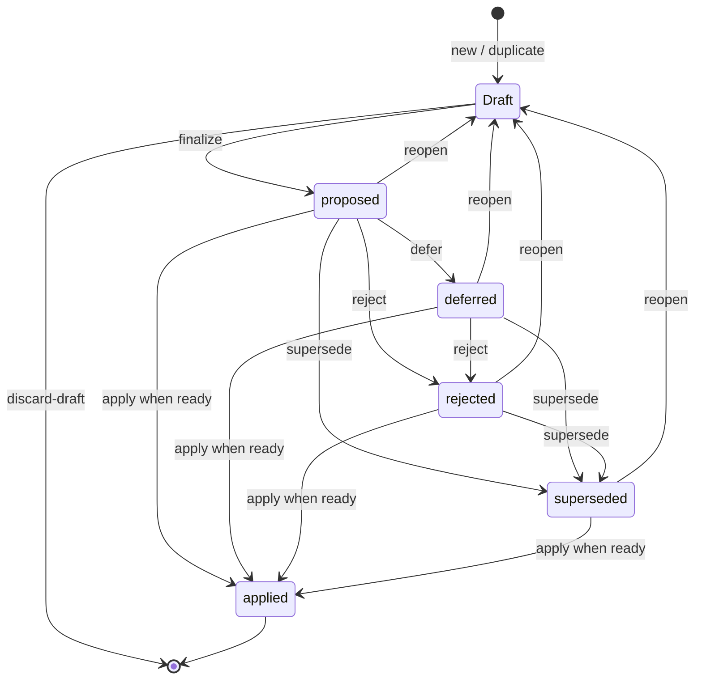

# The Proposal lifecycle

A Proposal records a group of language-project changes from its first editable Draft through Apply or a decision to set it aside. Parser results and Dry Runs provide evidence for Apply; they are attached to the Proposal’s content, not additional lifecycle states.

## From Draft to Proposal

`new` starts a Draft, and `duplicate` starts one from existing Proposal content. A Draft can be edited and discarded. `finalize` writes an immutable revision and makes the Proposal `proposed`.

`reopen` copies a finalized Proposal into a new Draft with the same Proposal ID. Editing that Draft does not rewrite the old revision. Finalizing it writes a new revision and returns the Proposal to `proposed`. Discarding a reopened Draft restores the previously finalized content; discarding a new Draft removes it.

## The five Proposal statuses

| Status | Meaning |
| --- | --- |
| `proposed` | The Proposal has a finalized revision and may be measured or applied. |
| `deferred` | The changes are still wanted, but are set aside for later. |
| `rejected` | The changes are not wanted. |
| `applied` | The changes were written to the FieldWorks project and a Receipt was recorded. |
| `superseded` | Another Proposal replaces this one; the replacing Proposal is named. |

`defer` moves a `proposed` Proposal to `deferred`. `reject` accepts `proposed` or `deferred`. `supersede` accepts `proposed`, `deferred` or `rejected`. `reopen` can create a Draft from any finalized status except `applied`; finalizing the Draft makes the Proposal `proposed` again.

There is no `approve` command or approval status. Apply depends on evidence, not a person's approval. Status commands do not themselves apply changes.

## Evidence and Apply

A Dry Run applies the Proposal to a throwaway project copy and reads the effects back. A Trial can also produce one or more Assessments. These records describe a particular Proposal revision and project state; amending the Proposal invalidates evidence bound to the earlier revision.

Apply requires a bound Dry Run and Readiness evidence. Readiness requires a Correctness Assessment for the current content and project state, complete evidence for changed words, and no regression when regression checking is enabled. Apply also checks that each pending change still fits the current project, that FieldWorks is not holding the project open, and that its preflight succeeds. `--force` can override Readiness reasons. It cannot force a pending change that no longer fits.

On success, Motif writes the changes in one LibLCM unit of work, records the applied-change log entry and Receipt, and marks the Proposal `applied`. An ambiguous save or reconciliation outcome is reported for the caller to resolve before retrying.

## Status diagram

The status transitions shown for `apply` are evidence-gated. Apply does not require a particular prior status; Readiness, preflight and the live-project checks determine whether it can proceed.
