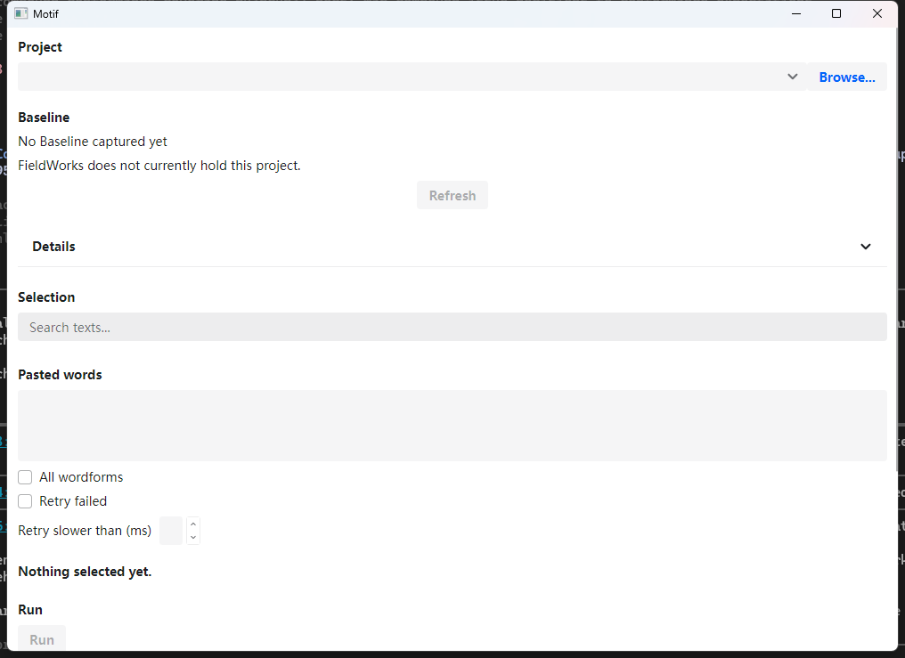

# Native window preflight

The built Motif application opens a real Windows window, and Windows UI Automation can reach its
controls. This is startup evidence only; it does not establish the completed Assessment or Handoff workflow.

**Subsequent evidence:** the [native workflow verification](2026-09-09-native-window-workflow.md)
records the implemented workflow, actual 125%/150% runs, controlled incomplete words, cancellation,
held-lock refresh, keyboard traversal and file drops. The remaining-check descriptions below belong
to this earlier startup probe. Actual 200% and authoritative Correctness remain incomplete.

## Observed startup

The window was launched against a fresh empty MOTIF_WORKER_ROOT. It was closed after inspection and
its previous window-preference bytes were restored. No existing language project was opened.

- Source implementation: f420acc; later commits changed design documentation only.
- SIL.Motif.App.dll SHA-256: 54165a244294c0807daf34b4cc8a067e6dea48c623a020a1aec4f5ac6e870c77.
- GetDpiForWindow: 96 DPI, or 100% scaling.
- GetWindowRect: 1016 by 739 pixels, including window decoration.
- Display: 1920 by 1080 pixels, with a 1920 by 1032 work area.
- UI Automation found named project, selection, Assessment and Handoff controls.
- With no project selected, Refresh, Run and Write Handoff were disabled.

The screenshot was inspected. The content continues below the initial viewport through a ScrollViewer.
UI Automation reported some below-viewport controls as not offscreen; automation must account for the
actual clipped rectangle and scroll before clicking, rather than trust that flag alone.
The [raw probe result](native-window-preflight/evidence.json) retains the accessible names and flags.

## Remaining verification

The full workflow still needs the final Assessment implementation and a retained parseable runtime
fixture. Baseline capture, held-lock recapture, selection interactions, successful Assessment, statistics,
Handoff output, cancellation, actual keyboard traversal and a file drop into another native window have
not been established by this smoke check.

The requested 125%, 150% and 200% views remain unverified. No display setting was changed. The current
900 by 600 logical minimum would require 1800 by 1200 pixels at 200%, exceeding this display's work-area
height. Rendering at an emulated scale would not prove the requested actual monitor-scaling behavior.

## Harness constraints

The automation host must use a consistent .NET assembly set. The first PowerShell 7 probe loaded
Framework UI Automation assemblies and failed resolving UIAutomationTypes 10.0. Windows PowerShell 5
with its matching assemblies completed the probe. This was a harness failure, not an application failure.

An attempt to retain the fixture from PowerShell needed explicit ICU 72.1.0.3 selection. The default
PowerShell process loaded another ICU version, correctly triggering the Host's runtime assertion before
cache creation. Selecting the repository's native ICU directory resolved that mismatch. The remaining
internal-helper reflection probe was not executed: Windows refused to create its elevated process twice.
The already-committed real-parser fixture test remains verified by the full test gate; this manual export
probe does not replace or invalidate that evidence.
