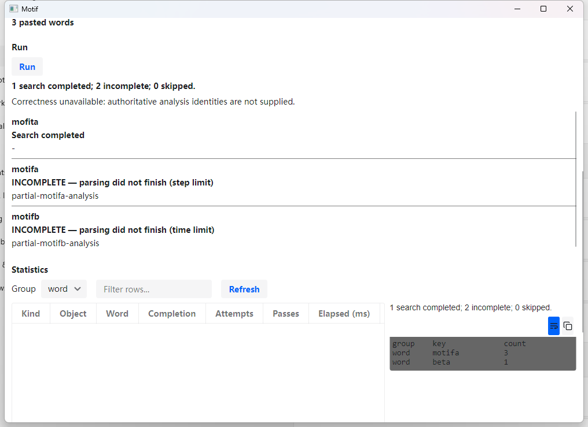

# Native Assessment and Handoff verification

People can measure the generated language project and create a Handoff through the actual Windows
application. Words stopped by a limit visibly remain incomplete, including when they contain partial analyses.

**Status: INCOMPLETE — we are not done.** Authoritative Correctness is unavailable, and actual 200%
rendering remains unverified. The [PanGloss handoff](2026-09-09-pangloss-correctness-handoff.md) defines
the remaining producer and comparison work; these desktop checks cannot establish it.

## Verified behavior

The window was exercised using a disposable project created from the repository's blank LibLCM fixture.
No external language project was required. Each run used a fresh managed root and restored the previous
window-preference bytes after closing the application.

| Check | Evidence and result |
| --- | --- |
| Real Assessment | Selected the saved fixture through the native picker and pasted `motifa`, `motifb`, and `mofita`. All three searches completed; the first two produced analyses, while the absent form did not. Correctness remained explicitly unavailable. |
| Statistics | Refreshed the displayed Assessment's real word statistics. The grid showed forms, completion, attempts, passes, and milliseconds. The bounded statistics area left Handoff reachable by scrolling. |
| Handoff | Selected an owned destination in the native folder picker. The real parser workflow published 16 files, including grammar, text, statistics, and instructions. |
| Per-word incomplete | A controlled fake supplied a CAP with a partial signature, a timeout with a partial signature, and a completed word without an analysis. Both incomplete words retained distinct reasons and partial findings; the summary read `1 search completed; 2 incomplete; 0 skipped.` |
| Cancellation | Cancelled an active controlled parser from the native window. Its heartbeat stopped, the window reported that no Assessments were recorded, and no unpublished invocation directory remained. |
| Held-lock refresh | Refreshed while the owned fixture had a lock marker and an open read handle preventing writes. The native Baseline reported that FieldWorks held the project. Source hashes remained equal and the caller's lock remained present until harness cleanup. This simulates the lock; it is not an actual FieldWorks session. |
| Keyboard traversal | Sent Tab repeatedly from Browse with a valid pasted word. Focus reached Known projects, Refresh, text search/selection, pasted words, selection options, Run, Include FLExText XML, and Handoff before cycling back. The raw sequence retains accessible names and rectangles. |
| Native file drop | Dragged `All files` and then `grammar.json` into an owned Windows Forms receiver. It received exactly the 16 published paths and then the single grammar path. No files were uploaded or sent to an external application. |

The fake incomplete and cancellation cases establish presentation and lifecycle behavior. They do not
establish real-parser identity fidelity, timing values, or reproduction of approved analyses.

## Actual display scaling

The workflow was run at Windows' actual monitor scaling, measured with `GetDpiForWindow` in a
per-monitor-aware automation host. Screenshots were inspected; these are not emulated scaling results.

| Windows scale | Measured DPI | Result |
| --- | --- | --- |
| 100% | 96 | Assessment, statistics, and 16-file Handoff; cancellation, controlled lock, keyboard, and file-drop checks. |
| 125% | 120 | Assessment, statistics, and 16-file Handoff reached in the normal window. |
| 150% | 144 | Assessment, statistics, and 16-file Handoff reached in the maximized window. |
| 200% | Unavailable | The connected 1920-by-1080 display offers only 100%, 125%, 150%, and 175%. The attempted 200% selection found no choice. No custom scaling, sign-out, or registry change was used. |

The window's 900-by-600 logical minimum would need at least 1800-by-1200 physical pixels at 200%,
before decoration. Its behavior on a suitable display still needs verification and any necessary fix.
The display was restored to 100%, its available choices were recorded, and the Settings window opened
for these checks was closed. [Restoration evidence](native-window-workflow/display-restoration.txt).

The 125% and 150% runs used App DLL hash
`C23B76170B472298E53E68E3B5CD2283FCD6BAEF9B3B09EEBCAC2ABF980F0753`.
The final 100% workflow used
`984EFA420AA92052C8216879859F94B20B31FE234F28FDE8EE607A405A3B15E9` after the singular-summary wording
and distinct statistics limit reasons were corrected. No layout changed between those builds.
The real PanGloss executable hash was
`748118F6A0CF0218A74EE1C54C1209E0C5B8175F99AD09B6889AAC245FCF6CEB`.

## Retained evidence

The artifacts distinguish the actual parser workflow from the controlled failure cases. Temporary
paths in the JSON identify the owned fixtures used in the run, rather than persistent user projects.

- Final 100%: [Assessment](native-window-workflow/assessment-100.png),
  [statistics](native-window-workflow/statistics-100.png),
  [Handoff](native-window-workflow/handoff-100.png), [window measurements](native-window-workflow/workflow-100.json).
- 125%: [Handoff](native-window-workflow/handoff-125.png), [measurements](native-window-workflow/workflow-125.json).
- 150%: [Handoff](native-window-workflow/handoff-150.png), [measurements](native-window-workflow/workflow-150.json).
- Controlled cases: [incomplete words](native-window-workflow/incomplete-100.json),
  [cancellation](native-window-workflow/cancel-result.txt),
  [held-lock screenshot](native-window-workflow/held-lock-100.png),
  [lock and keyboard result](native-window-workflow/lock-keyboard-result.txt),
  [keyboard sequence](native-window-workflow/keyboard-100.json).
- File dragging: [asserted results](native-window-workflow/drag-result.txt) and exact receipts under
  `native-window-workflow/drop-receipts/`.
- Repository gate: `./test.ps1` with the real parser selected passed **1633 tests, 19 skipped, 0 failed**;
  comment hygiene passed. [Terminal summary](native-window-workflow/test-gate.txt).

Independent review found no remaining concrete defects in the final completion labels and summary
wording. Correctness and actual 200% acceptance remain open despite this passing gate.

## Harness findings

The automation needed real native input and explicit bounds checks to exercise what a person sees.
UI Automation alone sometimes reported clipped controls as visible.

Windows PowerShell 5 supplied a consistent UI Automation assembly set. Native pickers required keyboard
input and pointer clicks because some exposed panes lacked Invoke/Value patterns. Mouse-wheel scrolling
brought the lower panels into view. A first lock harness used a writable source handle incompatible with
the documented saved-file reader; using a read handle still prevented writes while allowing capture.
The drop receiver required explicit Copy acceptance during drag enter and drag over, and receipt filtering
had to exclude diagnostic text. Those harness failures were resolved before the passing results above.
